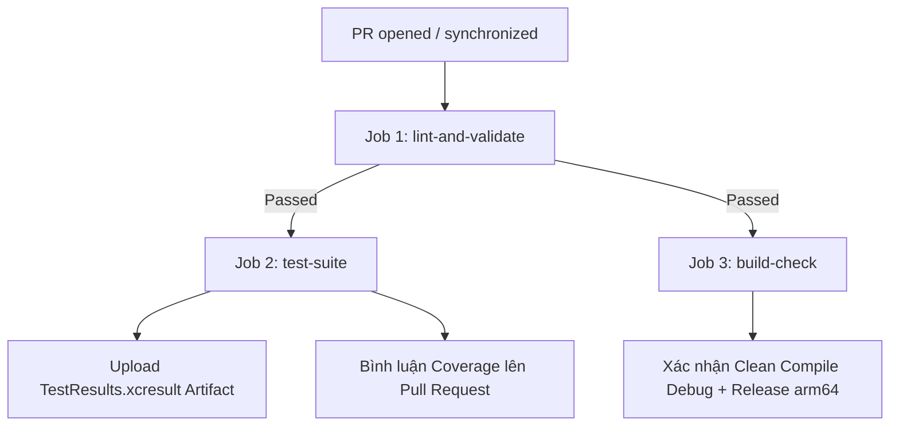

# HƯỚNG DẪN KÍCH HOẠT VÀ CẤU HÌNH GITHUB ACTIONS CI/CD CHO FORMFIT

Pipeline CI của dự án FormFit được cấu hình tự động tại:  
📂 `.github/workflows/ios-ci.yml`

File cấu hình quy chuẩn code:  
📂 `.swiftlint.yml`

---

## 1. TỔNG QUAN LUỒNG WORKFLOW

Mỗi khi có Pull Request mở vào `main` / `develop` hoặc push commit lên `main`, workflow sẽ chạy qua 3 Jobs:

1. **Job 1 (`lint-and-validate`) - Fail-Fast**:
   - Chạy `SwiftLint` ở chế độ `--strict` (cảnh báo được tính là lỗi).
   - Nếu vi phạm quy tắc đặt tên, force unwrap hoặc độ dài hàm/file, job sẽ dừng ngay lập tức để tiết kiệm phút chạy máy ảo macOS.
2. **Job 2 (`test-suite`)**:
   - Sử dụng cache SPM `.build` và `DerivedData` tối ưu thời gian build.
   - Khởi động Simulator iPhone 15 Pro iOS 17+.
   - Chạy toàn bộ Unit Tests & UI Tests với `xcodebuild test -enableCodeCoverage YES`.
   - Định dạng output bằng `xcbeautify`.
   - Trích xuất Code Coverage qua `xcrun xccov` và lưu trữ `TestResults.xcresult` trong 7 ngày làm Artifact.
3. **Job 3 (`build-check`)**:
   - Chạy `xcodebuild clean build` cho cả 2 cấu hình **Debug** và **Release** với `destination "generic/platform=iOS"` và cờ `CODE_SIGNING_ALLOWED=NO` nhằm xác nhận mã nguồn biên dịch thành công 100% trên chip thiết bị thật (arm64) mà không cần chứng chỉ Apple Developer Certificate trong khâu PR.

---

## 2. HƯỚNG DẪN KÍCH HOẠT QUYỀN `GITHUB_TOKEN` TRÊN REPOSITORY

Để bot GitHub Actions có quyền tự động bình luận bảng thống kê Code Coverage lên các Pull Request, bạn cần bật quyền ghi cho `GITHUB_TOKEN` trên GitHub:

1. Truy cập vào Repository trên GitHub:  
   `https://github.com/vietdvdev/formfit-mobile` (hoặc repo của bạn).
2. Vào tab **Settings** $\rightarrow$ Chọn **Actions** ở thanh bên trái $\rightarrow$ Chọn **General**.
3. Cuộn xuống mục **Workflow permissions**:
   - Chuyển từ tùy chọn mặc định *"Read repository contents permission"* sang:  
     👉 **Read and write permissions**.
   - Tích chọn thêm ô:  
     ☑️ **Allow GitHub Actions to create and approve pull requests**.
4. Bấm **Save**.

---

## 3. CÁC SECRET TÙY CHỌN (OPTIONAL SECRETS)

Workflow hiện tại dùng `CODE_SIGNING_ALLOWED=NO` nên **không bắt buộc phải có secret chứng chỉ Apple**.  
Khi dự án bước vào giai đoạn tự động đẩy lên TestFlight (CD Deployment), bạn có thể bổ sung các Secret sau vào mục **Settings $\rightarrow$ Secrets and variables $\rightarrow$ Actions**:

* `APP_STORE_CONNECT_API_KEY_ID`: Key ID của App Store Connect API.
* `APP_STORE_CONNECT_ISSUER_ID`: Issuer ID.
* `APP_STORE_CONNECT_PRIVATE_KEY`: Private Key (`.p8`).
