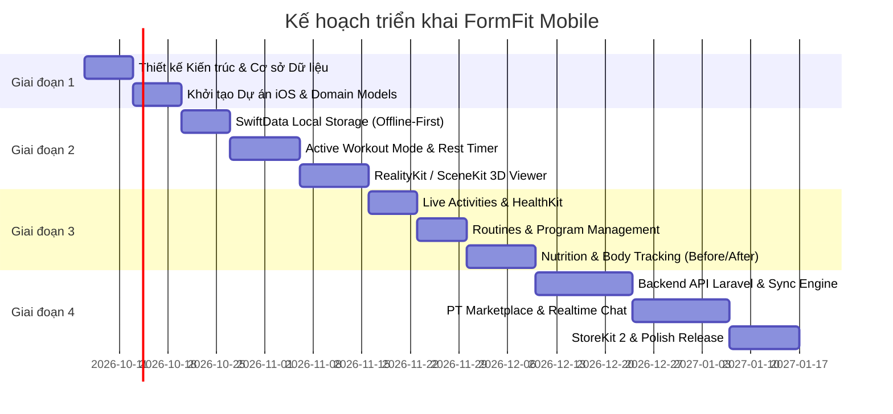

# FORMFIT MOBILE - PRODUCT SPECIFICATION & ROADMAP

> **Dự án:** FormFit Mobile  
> **Nền tảng:** iOS (Swift Native, SwiftUI) & Backend Cloud API (Laravel)  
> **Kiến trúc chính:** Offline-First, Clean Architecture / MVVM, 3D Anatomy Visualization (RealityKit/SceneKit)

---

## 1. TỔNG QUAN HỆ THỐNG
* **Tên dự án:** FormFit
* **Định vị:** Ứng dụng theo dõi luyện tập thể hình thế hệ mới, hỗ trợ visual giải phẫu 3D trực quan, hoạt động mượt mà ngoại tuyến (Offline-First), đồng bộ chỉ số sức khỏe và tích hợp nền tảng kết nối Huấn luyện viên trực tuyến (PT Marketplace).
* **Môi trường triển khai:**
  * **Ứng dụng di động:** iOS (iPhone, tương thích Apple Watch).
  * **Hệ thống quản trị & API:** Máy chủ Cloud (Linux / Docker).

---

## 2. KIẾN TRÚC CÔNG NGHỆ (TECH STACK)

### 2.1. Ứng dụng Di động (Mobile App - iOS)
* **Ngôn ngữ & Giao diện:** Swift Native kết hợp SwiftUI (tối ưu hóa 60 FPS, iOS 17+).
* **Kiến trúc Code:** MVVM + Clean Architecture / Repository Pattern.
* **Đồ họa & Dựng hình 3D:** RealityKit và SceneKit xử lý mô hình giải phẫu 3D định dạng `.usdz` và `.glb` (nén Draco), hỗ trợ đổ bóng, tách lớp lưới cơ bắp và xoay góc nhìn 360°.
* **Lưu trữ Cục bộ (Local Database):** SwiftData (hoặc CoreData) làm Single Source of Truth phục vụ cơ chế Offline-First.
* **Tích hợp Nền tảng Apple:**
  * **HealthKit:** Đọc nhịp tim thực tế, đồng bộ calo tiêu thụ và ghi nhận bài tập thể lực.
  * **ActivityKit (Live Activities & Dynamic Island):** Bộ đếm thời gian nghỉ (Rest Timer) và hiệp tập hiện tại trên màn hình khóa.
  * **StoreKit 2:** Quản lý giao dịch mua gói thuê bao định kỳ (Auto-Renewable Subscriptions).

### 2.2. Hệ thống Máy chủ & Dữ liệu (Backend & API)
* **Framework:** Laravel RESTful API (xác thực Sanctum/JWT, phân quyền RBAC).
* **Database:** PostgreSQL / MySQL (lưu trữ người dùng, bài tập, thực phẩm, lịch sử tập, hợp đồng PT).
* **Cache & Queue:** Redis (cache catalog bài tập, queue đồng bộ dữ liệu nền).
* **Realtime:** WebSocket (Laravel Reverb hoặc Socket.io) cho nhắn tin PT - Học viên.
* **Storage & CDN:** Cloudflare R2 / AWS S3 kết hợp CDN phân phối video và tài nguyên 3D (`.usdz`).

---

## 3. CÁC TÍNH NĂNG CHÍNH (FEATURE SPECIFICATIONS)

### 3.1. Thư Viện Bài Tập & Trình Mô Phỏng 3D
* **Kho dữ liệu bài tập:** Phân loại theo nhóm cơ chính (ngực, lưng, chân, vai, tay, bụng) và nhóm cơ phụ.
* **Mô phỏng 3D tương tác:**
  * Xoay 360°, phóng to/thu nhỏ, xem quỹ đạo chuyển động tạ và khớp nối.
  * Highlight khối cơ co bóp theo từng pha (Eccentric - Concentric).
  * Điều khiển playback: Tua chậm, tạm dừng, tua lại.
* **Bộ lọc dụng cụ:** Tạ đòn, tạ đơn, dây cáp, máy khối, dây kháng lực, bodyweight.
* **On-Demand Streaming:** Tải ngầm model 3D theo nhu cầu và cache cục bộ.

### 3.2. Chế Độ Tập Luyện Trực Tiếp (Active Workout Mode)
* **Vận hành Offline-First:** Ghi chép không cần mạng, tự động đồng bộ khi online.
* **Ghi chép hiệp tập (Set Logging):** Lưu hiệp, tạ (kg/lbs), số reps, chỉ số RPE.
* **Bộ đếm nghỉ tự động (Rest Timer):** Đếm ngược sau khi hoàn thành hiệp, phát rung/chuông, tích hợp Live Activities & Dynamic Island.
* **Đổi bài tập tương đương (Exercise Swap):** Gợi ý động tác thay thế có cùng nhóm cơ và dụng cụ tương đương.

### 3.3. Quản Lý Giáo Án & Lịch Trình (Routines & Programs)
* **Giáo án cài sẵn:** Lộ trình chuẩn (PPL, Upper/Lower, Fullbody, Giảm mỡ nữ, Sức mạnh).
* **Tự tạo giáo án:** Tùy biến bài tập, kéo-thả sắp xếp, số set/rep và rest time mặc định.
* **Lên lịch tập thông minh:** Gán buổi tập vào lịch tuần, gửi local push notifications nhắc nhở.

### 3.4. Dinh Dưỡng & Theo Dõi Tiến Trình Cơ Thể
* **Tính toán nhu cầu năng lượng:** Tự động tính TDEE/BMR, phân bổ Macros (Đạm, Tinh bột, Béo).
* **Nhật ký ăn uống:** Ghi chép bữa ăn, tính toán calo tiêu thụ và calo còn lại trong ngày.
* **Biểu đồ biến thiên vóc dáng:** Trực quan hóa cân nặng, tỷ lệ mỡ, số đo các vòng theo tuần/tháng.
* **Kho ảnh Before/After:** Chụp ảnh tiến trình với Ghost Overlay đối chiếu góc chụp cũ.

### 3.5. Nền Tảng Kết Nối Huấn Luyện Viên (PT Marketplace)
* **Hồ sơ năng lực PT:** Chứng chỉ, số năm kinh nghiệm, thế mạnh, đánh giá và học phí.
* **Phân quyền 3 cấp độ:**
  * **Học viên:** Xem bài tập, thuê PT, nhận bài tập/thực đơn, gửi log buổi tập.
  * **Huấn luyện viên:** Quản lý học viên, giao giáo án, theo dõi tiến độ tập luyện.
  * **Admin:** Duyệt bằng cấp PT, đối soát doanh thu, giải quyết khiếu nại.
* **Chat 1-1 & Form Feedback:** Nhắn tin thời gian thực, gửi video để PT phân tích form động tác.

### 3.6. Cơ Chế Kiếm Tiền (Monetization)
* **FormFit Free:** Thư viện 3D cơ bản, log hiệp tập đơn lẻ, đếm giờ nghỉ cơ bản.
* **FormFit Pro:** Không giới hạn giáo án tùy biến, biểu đồ chuyên sâu, không quảng cáo.
* **Platform Commission:** Trích hoa hồng trên mỗi hợp đồng thuê PT.

---

## 4. CHI TIẾT KẾ HOẠCH TRIỂN KHAI (ROADMAP)

### Phase 1: Nền Tảng Kiến Trúc & Cấu Trúc Dữ Liệu
- [ ] Thiết kế ERD & Schema (PostgreSQL/MySQL + SwiftData Entities).
- [ ] Khởi tạo Xcode Project chuẩn MVVM + Clean Architecture.
- [ ] Xây dựng hệ thống UI Components (Design System, Theme, Typography, Colors).
- [ ] Xây dựng tầng Network Abstraction & Local Storage Client.

### Phase 2: Core Workout & Trình Diễn 3D
- [ ] Xây dựng `Exercise` Catalog & bộ lọc cơ / dụng cụ.
- [ ] Tích hợp `SceneKit` / `RealityKit` render mô hình `.usdz` / `.glb` 360°.
- [ ] Triển khai `Active Workout Mode` (Ghi nhận Set/Rep/Weight/RPE).
- [ ] Xây dựng bộ đếm giờ nghỉ `Rest Timer` cục bộ.

### Phase 3: Nâng Cao Trải Nghiệm iOS & Dinh Dưỡng
- [ ] Tích hợp `ActivityKit` (Live Activities & Dynamic Island) cho Rest Timer.
- [ ] Tích hợp `HealthKit` (đồng bộ nhịp tim, bài tập, calo tiêu thụ).
- [ ] Xây dựng module Quản lý Giáo án (`Routines & Programs`).
- [ ] Xây dựng module Dinh dưỡng (BMR/TDEE & Macro Tracker).
- [ ] Module Theo dõi cơ thể & Ghost Overlay Camera cho ảnh Before/After.

### Phase 4: Backend API, Đồng Bộ & PT Marketplace
- [ ] Xây dựng Laravel REST API (Authentication, Exercises, Workout Logs).
- [ ] Hiện thực Sync Engine 2 chiều (Local SwiftData <-> Cloud Backend).
- [ ] Xây dựng chức năng PT Marketplace (Profile PT, Thuê PT, Giao bài).
- [ ] Tích hợp Realtime Chat (WebSocket) hỗ trợ gửi video chữa Form.
- [ ] Tích hợp `StoreKit 2` (Gói thuê bao FormFit Pro).
- [ ] Kiểm thử, tối ưu hóa bộ nhớ, đóng gói & phát hành TestFlight.
